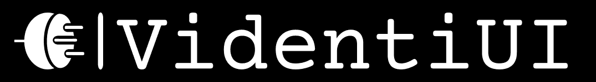

### A UI library targeting real-time applications, with elements specified using Lua.

Features:

* Custom UI Element types and reactivity built in lua, including:
	* Querying for key presses, mouse clicks and mouse position in Lua.
	* Editing properties of UI elements through scripts, such as color, texture, position and dimensions.
* Support for custom rendering backends and wide cross-platform support

Goals:

* Fast
* Reliable (i.e. prefers null objects and error logs rather than crashing)
* Ease of use and extensibility
* Suited to games, not websites
